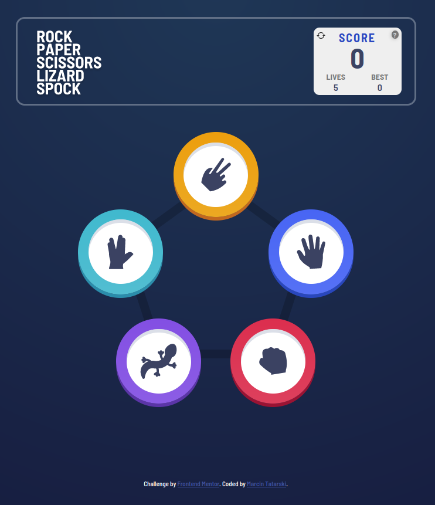

# Rock-Paper-Scissors-Lizard-Spock

Welcome to my implementation of the classic Rock-Paper-Scissors-Lizard-Spock game. 

## Features
- View the optimal layout for the game depending on their device's screen size
- Play Rock, Paper, Scissors, Lizard, Spock against the computer
- Maintain the state of the score after refreshing the browser 
- Best score for the game
- Reset game button ⟳  
- Five lives ❤ per game, can be reset during the game, but at the expense of resetting the overall score

## Screenshot


## Installation

```
 git clone https://github.com/martindocs/rock-paper-scissors-lizard-spock.git

 # cd into the project directory

 # If you have Live Server, visit http://localhost:5500 
 
 # Otherwise just double click index.html
```

## Contributing

Pull requests are much appreciated and accepted.

1. <a href='https://help.github.com/articles/fork-a-repo/'>**Fork**</a> the repo on GitHub.
2. <a href='https://help.github.com/articles/cloning-a-repository/'>**Clone**</a> the project to your own machine.
3. <a href='https://git-scm.com/book/en/v2/Git-Basics-Recording-Changes-to-the-Repository'>**Commit**</a> changes to <a href='https://git-scm.com/book/en/v2/Git-Branching-Branches-in-a-Nutshell'>**development branch**</a>.
4. <a href='https://help.github.com/articles/pushing-to-a-remote/'>**Push**</a> your work back up to your fork.
5. Submit a <a href='https://help.github.com/articles/about-pull-requests/'>**Pull request**</a> so that i can review your changes

## Credits

This project is a solution to the [Launch countdown timer challenge on Frontend Mentor](https://www.frontendmentor.io/challenges/rock-paper-scissors-game-pTgwgvgH).

## Contributions

N/A (Open for contributions).

## License

Please refer to the [LICENSE](./LICENSE.md) file in this repository for details on how this project is licensed.